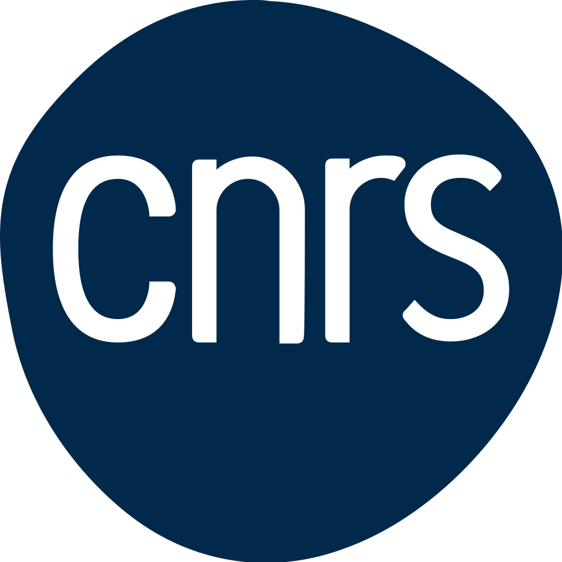
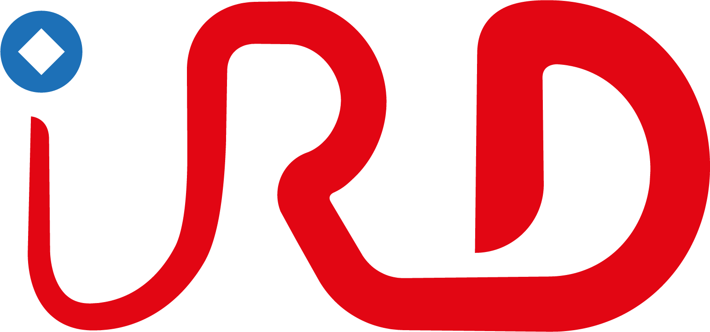
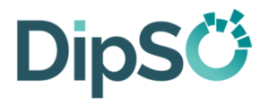

Le réseau est soutenu par les principaux organismes de recherche et d'enseignement supérieur. 

## Organismes fondateurs

::: {layout-ncol=2}
[{height=70px}](https://www.cnrs.fr/)

[{height=70px}](https://www.cirad.fr/)

[{height=70px}](https://www.inrae.fr/)

[{height=70px}](https://www.ird.fr/)
:::

## Financeurs

::: {layout-ncol=2}
[{height=70px}](https://www.inrae.fr/departements/mathnum)

[{height=70px}](https://www.inrae.fr/departements/bap)

[{height=70px}](https://www.inrae.fr/departements/sa)

[{height=70px}](https://science-ouverte.inrae.fr/fr/la-science-ouverte/la-direction-pour-la-science-ouverte)
:::
